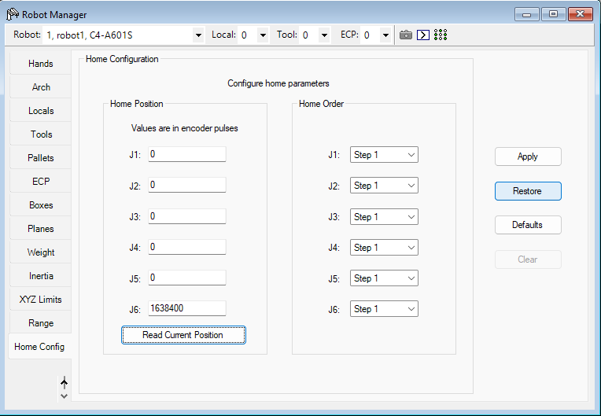

# Práctica 3
# Integrantes
* Gabriel Magaña Rendón
* Abel Morales Lino
* Agustín Téllez-Girón Sánchez
* Salvador Zaragoza Maldonado
# Introducción
<div align="justify">

En la tercera práctica de laboratorio se retomaron conceptos previamente vistos, como la movilización del robot en modo world. Esto fue fundamental para avanzar en la creación de puntos clave utilizando la opción "Jog & Teach", que se encuentra dentro del panel de control de "Robot Manager". Esta opción permite al operador manipular el robot de manera precisa y registrar posiciones específicas en el espacio de trabajo, las cuales serán empleadas posteriormente en la secuencia de movimientos del robot.

La práctica también introdujo la carga de código al brazo robótico Epson C4, permitiendo no solo la creación de puntos de interés, sino también la programación de la secuencia de activación de cada uno de esos puntos mediante los comandos Go y Home, cuya aplicación se revisará en mayor profundidad más adelante. Estos comandos son fundamentales para la navegación del robot entre posiciones previamente definidas, asegurando un movimiento eficiente y controlado.

Además, se trabajó con la activación de la pinza neumática, un accesorio esencial del brazo robótico que permite manipular objetos dentro del entorno de trabajo. La correcta sincronización entre los movimientos del brazo y el control de la pinza es clave para garantizar una operación precisa y segura en aplicaciones de automatización industrial.
</div>

# Instrucciones 
<div align="justify">
Se comenzó por crear un proyecto nuevo en el software Epson RC+, en el cual se reemplazaron nuevos valores del HOME, para ello se abrió el apartado de "Robot manager" y se configuró el movimiento del Robot en modo Joint para poder mover J6 a un valor de 90 grados, una vez hecho esto se abrió el apartado de "Home Config", se leyeron las posiciones y se configurarón como un nuevo Home[1].


  
*Figura 1. Configuración de un nuevo Home.*

Durante la siguiente operación, se comenzarón a realizar movimientos del robot en modo world y se grabaron en puntos diferentes, para realizar esto fue necesario una vez definidas cada una de las posiciones irse a la opción de "Teach" en la sección "Jog & Teach"; para ello es necesario saber que la posición que se va a guardar tiene que estar en un punto aún no definido en la sección de "Point" (Véase Figura 2) de no ser así la posición actual se sobreescibira con alguna posición guardada anteriormente.


*Figura 2. Puntos para guardar cada posición.*

Cada una de la información de los puntos guardados se podrán ver en el apartado "Points" dentro del mismo "Robot Manager", en donde se podra revisar la etiqueta con la que se guardo ese punto en especifico además de tener todas las coordenadas de la posición, desde aqui se pueden adminsitrar los puntos ya creados [1].


Figura 3. Sección Points dentro del robot manager*

Finalmente, para la ultima parte de la práctica fue necesario conectar el software al robot físico y realizar manualmente una serie de movimientos a prueba y error para grabarlos y más adelante programar la secuencia que permitirá mover un fusible de su posición original hacia una caja; durante la práctica se utilizó el siguiente codigo que activó la secuencia previamente descrita.

```
Function main
Home
On 2
Go primero
Go segundo
Off 2
Go primero
Home
Go tercero
On 2
Home
Go cuarto
Go quinto
Off 2
Go cuarto
Home
Go primero
Go segundo
On 2
Go primero
Home
Go tercero
Off 2
Home
Go cuarto
Go quinto
On 2
Go cuarto
Home
Fend
```
Es importante recalcar que en las lineas de código donde se tienen los comandos On y Off es debida a la activación de la pinza del brazo y se pone el número 2 debido a que se encuentra en dicho Bit de las salidas, esto se puede visualizar en la sección "I/O Monitor".

Acontinuación se agrega el video del funcionamiento de la secuencia previamente descrita.

[](https://drive.google.com/file/d/1C9VOyp0twD5em_AlmO6HtenzBoFVtHih/view?usp=drive_link)

*Video de la secuencia programada en el brazo.*
# Conclusiones 
<div align="justify">
  
  __Gabriel Magaña Rendón:__ 
</div>

<br/>

<div align="justify">
  
__Abel Morales Lino:__ 
</div>

<br/>
<div align="justify">
  
__Agustín Téllez-Girón Sánchez:__ 
</div>

<br/>
<div align="justify">
  
__Salvador Zaragoza Maldonado:__ 
</div>

# Referencias Bibliográficas
[1] Seiko Epson Corporation, *Robots de 6 ejes Serie C4 MANUAL DEL MANIPULADOR*, 2020, https://files.support.epson.com/far/docs/epson_c4-series_robot_manual(r20)_spanish_cpd60389.pdf.
